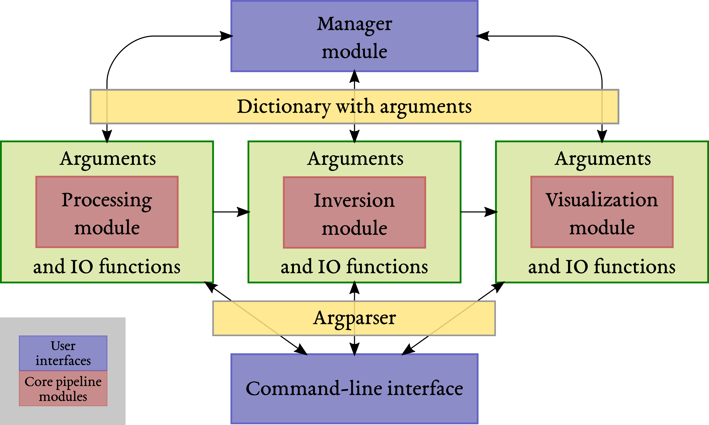

# ERT Project Manager #

## Description ##

A library for processing, invert, and visualize ERT datasets, with particular focus on time-lapse projects.

*Manager* is the pipeline management module, it organizes the ERT datasets and then delegates to the *process*, *invert*, and *plot* modules with suitable and consistent arguments.
Default values for the parameters (arguments) of each module are described and stored via argparse.
This also allows each module to be called directly from the command-line, bypassing the ert *manager* module.
Instead, when calling via *manager*, a dictionary is passed to each module to update its argparse default values.
This way generic-default values are given in each module but each project can store specific values with a simple *manager* API.
In practice, each module follows these same steps:
    1. check cmd-line args and possibly update argparse default values.
    2. update arguments in case the module is called from the manager with new arguments.
    3. check consistency and agreement of the updated parameters.

## Installation ##

1. Clone the repository into a local directory. Choose a convenient directory as you may want to edit the package.
2. Make sure you have install the dependencies:
    1. pyvista (it automatically installs pandas, numpy, other needed libraries)
    2. pybert (ert library, it automatically installs pygimli). Note that this is included in the setup dependencies.
    3. pip, re, os, argparse, setuptools, and others are commonly already installed
    4. optional but suggested is numba, which is use to optimize some numerical functions.
3. go to the clone repository, in the root folder (where setup.py is)
4. pip install the package with editable option: `pip install -e .`

The editable installation keeps the code in the current directory, rather than default python directories (i.e., site-package).
The advantage is that any change to the package will be available without bringing the changes in site-package by removing and reinstalling.
Alternatively, add the repository to the pythonpath variable (in .bashrc).
However, editable installation has several advantages as pip and python take care of the package (e.g., dependencies, autocomplete, etc.).

## Usage ##

Regarding the usage of the manager module, see the example in `./tests`.
For the command-line interface, see the argparse `--help` command of each pipeline module.
